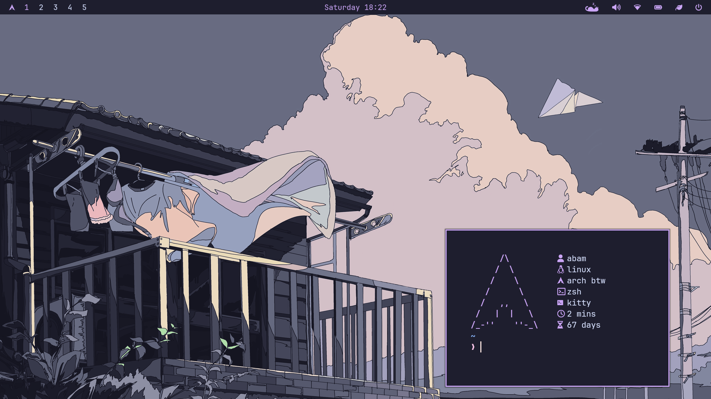

# Keybinds
1. SUPER + ENTER = Open kitty terminal
2. SUPER + Q = Close window
3. SUPER + D = Open wofi app launcher
4. SUPER + B = Open firefox browser
5. SUPER + E = Open yazi file manager
6. SUPER + N = Open nvim editor
7. SUPER + S = Screenshot and copy it to clipboard
9. SUPER + P = Install packages
10. SUPER + R = Remove installed packages
11. SUPER + W = Switch wallpaper
12. SUPER + F = Toggle window float
13. SUPER + SHIFT + E = Open nautilus file manager
14. ALT + C = Poweroff system
15. ALT + V = Reboot system
16. ALT + M = Logout
17. ALT + L = Lock system
18. SUPER + H/J/K/L = Window navigation
18. SUPER + SHIFT + H/J/K/L = Move Window
20. SUPER + 1-9 = Switch workspaces
21. SUPER + SHIFT + 1-9 = Move window to another workspace
22. SUPER + X = Volume up
23. SUPER + Z = Volume down
24. SUPER + SHIFT + X = Brightness up
25. SUPER + SHIFT + Z = Brightness down
# Prerequisites
1. A fully functional Arch Linux setup (installed with hyprland using the archinstall script)
2. Curl
# Installation
```bash
bash <(curl -fsSL https://raw.githubusercontent.com/excellogalihs/mocharice/main/install.sh)
```
After that, open nwg-look and change the theme, icon theme, and font. That's basically it. You get a usable and beautiful Arch Linux Hyprland setup with the Catppuccin Mocha theme.
